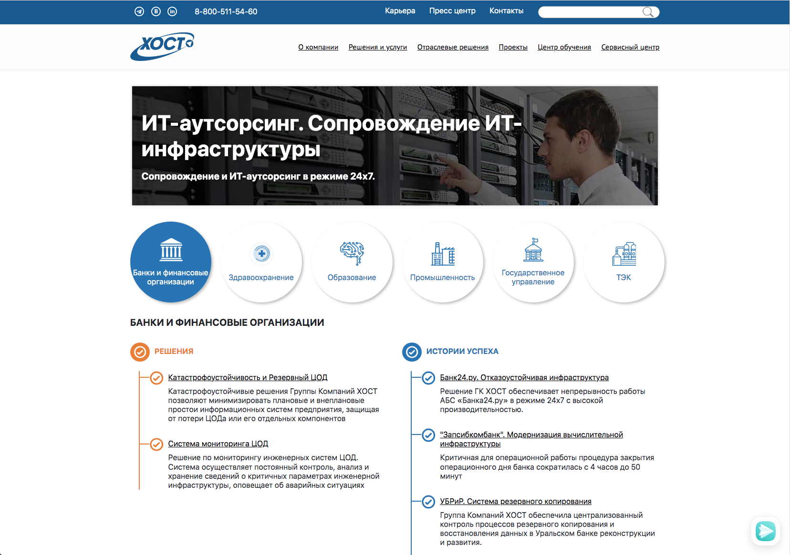
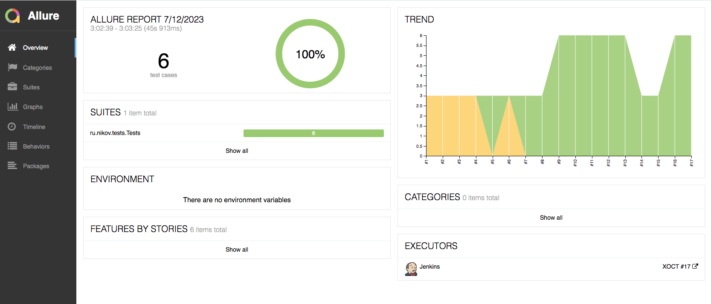
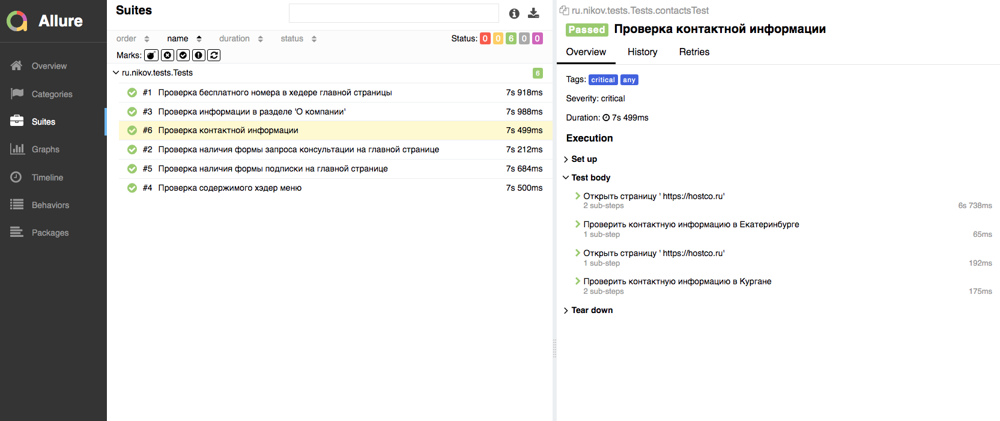
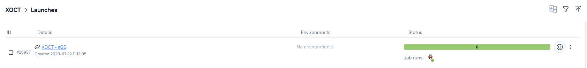
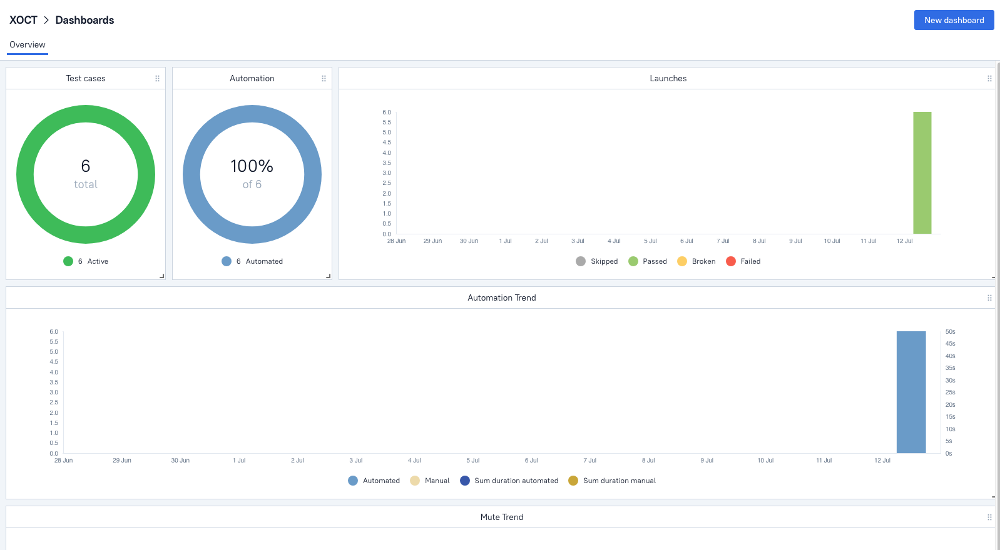
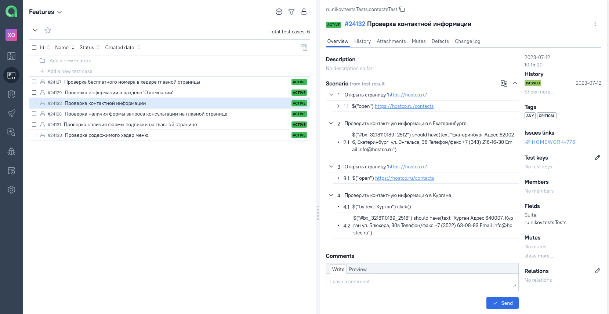
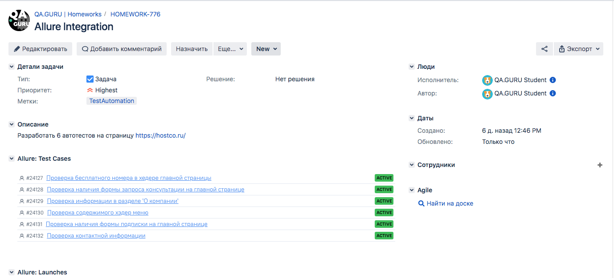
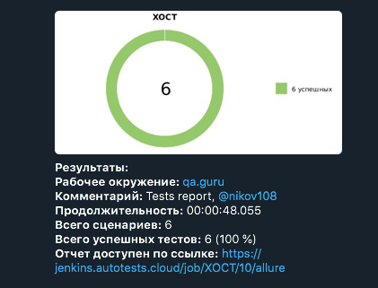
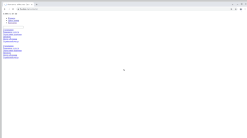

<h1 >Проект автоматизации тестирования UI для сайта <a href="https://hostco.ru/">XOCT</a></h1>



## :bookmark_tabs: Содержание


* <a href="#description">Описание</a>

* <a href="#tools">Технологии и инструменты</a>

* <a href="#cases">Реализованные проверки</a>

* <a href="#run">Запуск тестов</a>

* <a href="#allure">Отчеты в Allure Report</a>

* <a href="#allure-testops">Интеграция с Allure TestOps</a>

* <a href="#jira">Интеграция с Jira</a>

* <a href="#telegram">Уведомления в Telegram с использованием бота</a>

* <a href="#video">Пример прогона теста в Selenoid</a>

<a id="description"></a>
## :open_book: Описание
В проекте реализованы UI тесты для сайта [_hostco_](https://hostco.ru/)
Автотесты написаны на <code>Java</code> с использованием <code>JUnit 5</code> и <code>Gradle</code>.
Для тестов использован фреймворк [_Selenide_](https://selenide.org/).
Запуск тестов можно осуществлять локально или в [_Selenoid_](https://aerokube.com/selenoid/).
Также реализована сборка в <code>Jenkins</code> с формированием Allure-отчета и отправкой уведомления с результатами в <code>Telegram</code> после завершения прогона.

<a id="tools"></a>
## Технологии и инструменты

| Java                                                                                                    | IntelliJ Idea                                                                                                                | GitHub                                                                                                    | JUnit 5                                                                                                          | Gradle                                                                                                    | Selenide                                                                                                        | Selenoid                                                                                                                 |                                                                                                         Jenkins |
|:--------------------------------------------------------------------------------------------------------|------------------------------------------------------------------------------------------------------------------------------|-----------------------------------------------------------------------------------------------------------|------------------------------------------------------------------------------------------------------------------|-----------------------------------------------------------------------------------------------------------|-----------------------------------------------------------------------------------------------------------------|--------------------------------------------------------------------------------------------------------------------------|----------------------------------------------------------------------------------------------------------------:|
| <a href="https://www.java.com/"></a> | <a id ="tech" href="https://www.jetbrains.com/idea/"></a> | <a href="https://github.com/"></a> | <a href="https://junit.org/junit5/"></a> | <a href="https://gradle.org/"></a> | <a href="https://selenide.org/"></a> | <a href="https://aerokube.com/selenoid/"></a> | <a href="https://www.jenkins.io/"></a> |


| Jira                                                                                                                         | Allure                                                                                                                    | Allure TestOps                                                                                                      |
|:-----------------------------------------------------------------------------------------------------------------------------|---------------------------------------------------------------------------------------------------------------------------|---------------------------------------------------------------------------------------------------------------------|
| <a href="https://www.atlassian.com/ru/software/jira"></a> | <a href="https://github.com/allure-framework"></a> | <a href="https://qameta.io/"></a> |

<a id="cases"></a>
## :ballot_box_with_check: Реализованные проверки

- [x] Проверка содержимого хэдер меню
- [x] Проверка наличия формы запроса консультации на главной странице
- [x] Проверка контактной информации
- [x] Проверка наличия формы подписки на главной странице
- [x] Проверка бесплатного номера в хедере
- [x] Проверка информации в разделе 'О компании'

<a id="run"></a>
## :computer: Запуск тестов из терминала
### Локальный запуск тестов

```
gradle clean test 
```

### Удаленный запуск тестов

```
gradle clean test 
${TASK}
"-Dbrowser=${BROWSER}" 
"-DbrowserVersion=${BROWSER_VERSION}" 
"-DbrowserSize=${BROWSER_SIZE}" 
"-DremoteUrl=${REMOTE_URL}"

```
> `${TASK}` - запуск тестов с учетом _severity_  _<code>normal</code>_, _<code>critical</code>_, _<code>any</code>_
> 
> `${BROWSER}` - наименование браузера (_по умолчанию - <code>chrome</code>_).
>
> `${BROWSER_VERSION}` - версия браузера (_по умолчанию - <code>100.0</code>_).
>
> `${BROWSER_SIZE}` - размер окна браузера (_по умолчанию - <code>1920x1080</code>_).
>
> `${REMOTE_URL}` - адрес удаленного сервера, на котором будут запускаться тесты.

<a id="allure"></a>
## </a> Отчеты в Allure Report

### Основное окно

<p align="center">

</p>

### Тесты

>К каждой проверке прилагается скриншот страницы последнего действия в тесте, логи и видео.

<p align="center">

</p>

<a id="allure-testops"></a>
## </a> Интеграция с Allure TestOps

>Интеграция Allure TestOps с Jenkins позволяет запускать несколько выборочных тестов и следить за их выполнением в онлайн формате.

<p align="center">

</p>

>Прохождения тестов можно представить ввиде графиков.

<p align="center">

</p>

>Кейсы находятся в актуальном состоянии, поскольку сценарии выгружаются из кода.

<p align="center">

</p>

<a id="jira"></a>
## </a> Интеграция с Jira

### Связка Jira и Allure TestOps
<p align="center">

</p>


<a id="telegram"></a>
## </a> Уведомления в Telegram с использованием бота

<p >

</p>

<a id="video"></a>
## </a> Пример прогона теста в Selenoid

> Видео к прохождению теста "Проверка контактной информации".
<p align="center">
  
</p>
